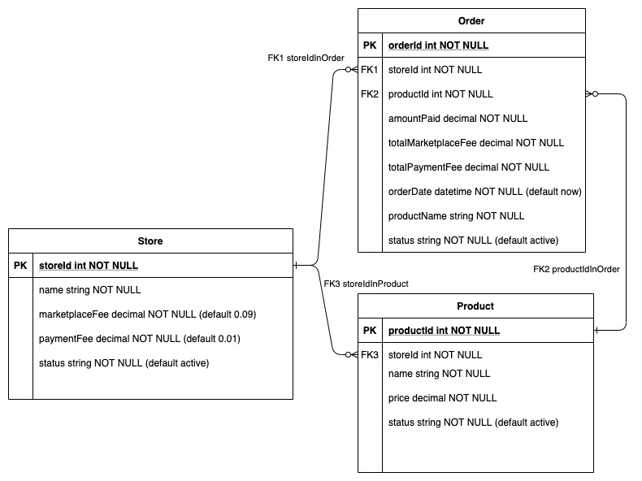

### simple-marketplace

#### Commands

- Instalation
```
npm install
```
- Startup
```
npm start
```
- Test and Lint
```
npm test
npm lint
```

---

#### API

- Swagger documentation included at localhost:3000/explorer

- API runs in localhost:3000/api

- API healthcheck runs in localhost:3000/

- **Endpoints**:

    - **STORES**
    - GET /api/stores
    - POST /api/stores
    - PUT /api/stores/{storeId}
    - DELETE /api/stores/{storeId}
    - **PRODUCTS**
    - GET /api/products
    - POST /api/products
    - DELETE /api/products/{storeId}
    - PUT /api/products/{storeId}
    - **ORDERS**
    - GET /api/orders
    - POST /api/orders

---

#### Database

- **ER Diagram**


  ---

- **Configuration**

    - NODE_ENV=test - in memory database
    - NODE_ENV=development - file database (database.json)
    - NODE_ENV=production - MySQL database

    - Database configuration can be switched in the */server/datasources.local.js* file

  ---
- **Logical deleting**

    - Objects in the store and product tables cannot be deleted from the database, instead, the DELETE APIs implement a logical/soft delete by using the **status** field: **"active"** for non-deleted rows and **"inactive"** for discarded content, removed from the storefront, this ensured database consistency and enable auditing for all purchases even after there stores/product have been disabled from sale.